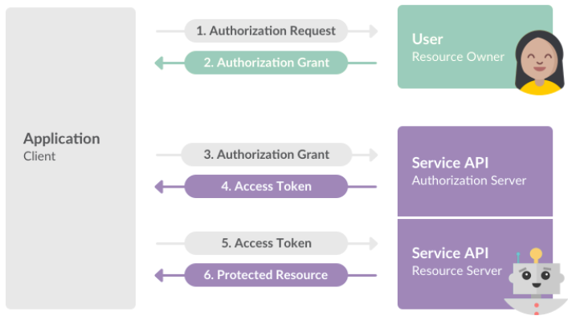
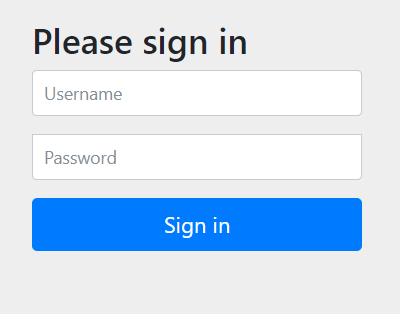
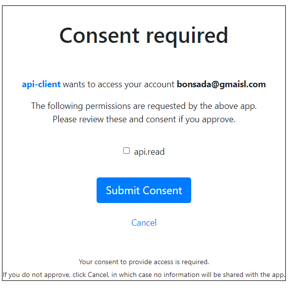
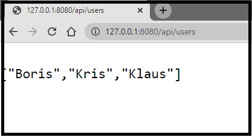

## OAuth2.0 Work Flow Overwiev:
This is fun project for better understanding very popular or standard authorization.
<center></center>

## Authorization Code Flow
The OAuth version 2.0 specification provides for several token acquisition scenarios. The most common of them assumes that at least three parties will be involved in the token acquisition process: *the **Client**, **Resource Server**, and the **Authorization server**. This method is called **Authorization Code Flow.**- **wich is used in my project** to better understanding all flow proces you can check this page: https://www.oauth.com/playground/

# *Project also uses:*
## OpenID Connect
OpenID Connect is a simple identity layer on top of the OAuth 2.0 protocol. It allows Clients to verify the identity of the End-User based on the authentication performed by an Authorization Server, as well as to obtain basic profile information about the End-User in an interoperable and REST-like manner.
## The project consists of 3 modular applications such as::
- **spring-security-client** port8080
- **OAuth Resource-Server**   port 8090
- **OAuth Authorization-Server** port 9000

### In overview shorts application work:
1. Client call the authorization request request to get some resources.
```http
  GET /api/users
```
2. Next call the authorization-server. That particular API that has to be autheticated by Cutom Authorization Server wchich handle all authorization API-s. You will be redirect to this URI:
**/auth-server:9000/login** Where user should passing your crednetials:




3. After succesfull login. User will have to give the consent to use particular scopes -api.read. Like below:

**Scopes**- *they are use to specify exatly the reason for which acces to resoreces.*

**Example**: *Like we have login by gmail, after succesful login we are asking by client for conset to use particular: account profile, etc.*   




4. After submittinng consent, we are getting resoureses form resorces-server.


**Scopes** mozna potraktować jako uprawnienia do Twojego konta o które prosi client.


<!--  -->


